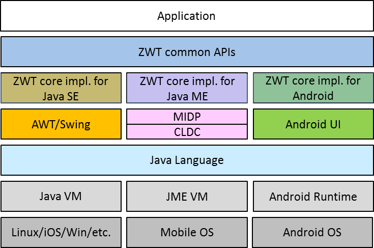

# ZWT

ZWT (Zero-change Windows Toolkit) is a cross-platform framework for developing GUIs, for any system that supports the Java language regardless the underlying UI libraries available for accessing graphical objects (like AWT and Swing for Java SE, MIDP for Java ME, or Android API for Android).

It provides a light set of well-known APIs (like classic Swing and AWT) for rapidly developing simple and totally cross-platform applications.

It supports all three main Java environments: Java SE/EE, Java ME Embedded, and Android, and can be used on any system that runs any of these environments.

The ZWT libraries (.jar and .ar), already compiled for the three different environments can be found in [libs]((/lib).

Internally, the ZWT source code is formed by two types of classes (two layers):

* common classes that are implemented independetly from the underlying platforms;
* core classes that have a different implementation for each platform.

However this differentiation is completely transparent for the users since they see only a set of classes and interfaces forming the ZWT APIs.



All source code of ZWT (including both common and specific sources) can be found in the following folders:
In particular:

* [src-common](/src-common): all ZWT common sources that are independent from the used platform.
* [src-se](/src-se): ZWT core sources specific for Java SE;
* [src-me](/src-me): ZWT core sources specific for Java ME;
* [src-android](/src-android): ZWT core sources specific for Android.


## Getting started

For developing an app with a cross-platform UI, you have only to:

* download the ZWT library (.jar or .ar) for the target platform(s);
* develop your app using the ZWT library; for example if you are using a PC with Java SE, you can you the corresponding ZWT jar for this phase;
* develop the the entry class used for starting your app in the target platform(s).

Let's go through these steps with a simple *Hello World* app. The resulting app can be run on Java SE, Java ME, and Android.

Since the ZWT library resembles other well-known GUI libraries (like Swing and AWT), writing the UI is very simple. Hereafter the code of an app that displays a label "Hello world" and a "Ok" button for exitin is shown:

```java
import it.unipr.netsec.zwt.*;
import it.unipr.netsec.zwt.layout.ZwtBorderLayout;

public class Hello {

	public Hello(ZwtFrame frame) {
		frame.setLayout(new ZwtBorderLayout());
		ZwtLabel label=new ZwtLabel("Hello world");
		label.setColor(ZwtColor.WHITE);
		label.setAlignment(ZwtLabel.ALIGN_HCENTER);
		frame.addComponent(label,ZwtBorderLayout.CENTER);
		ZwtButtonListener listener=new ZwtButtonListener() {
			@Override
			public void onButtonPushed(ZwtButton arg0) {
				System.exit(0);
			}
		};
		ZwtButton button=new ZwtButton("Ok",ZwtKeyboard.KEY_SELECT,listener);
		frame.addComponent(button,ZwtBorderLayout.SOUTH);
	}
}
```

For compiling the app, for example using a PC with Java SE, you can simply do:

```console
javac -cp zwt-se.jar Hello.java
```
The result generated byte code is cross-platform.

In order to test it on a PC with Java SE (with Swing), you have just to create a main class like the following:

```java
import javax.swing.JFrame;
import it.unipr.netsec.zwt.ZwtFrame;

public class HelloMain {

	public static void main(String[] args) {
		JFrame jframe=new JFrame();
		ZwtFrame frame=new ZwtFrame(jframe,200,100);
		new Hello(frame);
	}
}
```

Note that the main class can remain very simple also in case of a large app with complex UI. the main class has just to create a graphical object of the underlying platform (a *JFrame* in case of Java SE) and pass it to the actual platform-independent implementation of the app.

You can compile the *HelloMain.java* with:

```console
javac -cp zwt-se.jar:. HelloMain.java
```

and you can test it with:

```console
java -cp zwt-se.jar:. HelloMain
```

Replace ':' with ';' in case of Windows OS.
